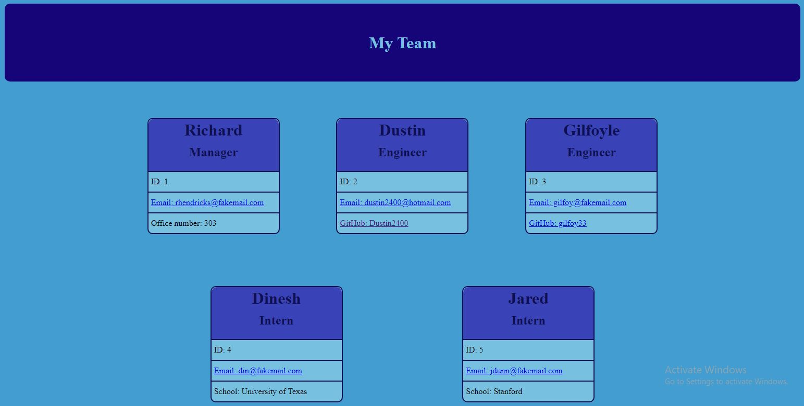

# team-profile-generator

## Description
  This application creates an easy to use employee directory after a series of prompts. Employees' emails and GitHubs are all available in one place.

  ## Table of Contents
  *[Installation](#installation)

  *[Usage](#usage)

  *[Links](#links)

  ## Installation
  Node.js and the npm application inquirer are required to run the application. Jest is required for the tests.

  ## Usage
  Simply download node.js, install inquirer from the npm server, and run the program by typeing node index.js in the command line. Answer all the questions and your team profile will be created.
  

  ## Links

  [GitHub](https://github.com/Dustin2400/team-profile-generator)

  [Video](https://watch.screencastify.com/v/WiR0BFx173IloKuaUy4t)

##
  Made with ❤️ by Dustin Grijalva